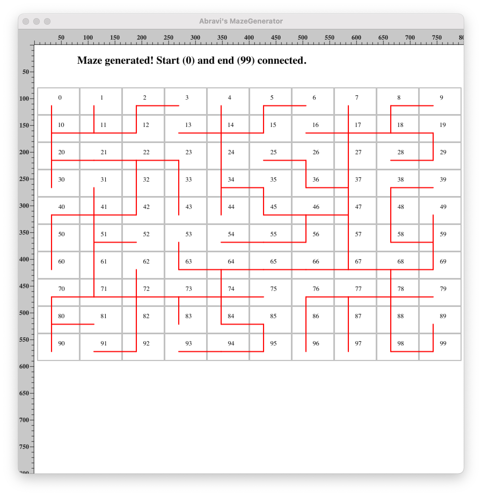

# **MazeGenerator**
A Java program that generates mazes of arbitrary size using the Union-Find(UF) algorithm.
This is a project from my Data Structure Class - Spring 2021.

## *Project's Implementation*
- Draw a grid of size N by M with an Arraylist on the canvas.
- Retrieve all the adjacent cells inside the grid and save them as Arraylist. 
The arraylist is shuffle to get random pairs, this generates a different maze everytime the code runs.
- Create an instance of UF of sie N * M. While passing the adjacent pairs, check connection of first and last cell.
- A knocked-down wall is represented by a red line on the canvas.

### Random Maze with a Grid of size 10 by 10

## *Technology*
- Language: Java
- Data Structure: ArrayList
- Data type: Integer

## *External Resources and Library*
-[x] [ObjectDraw]() for Maze visualisation.
-[x] [Union-find]() algorithm from Robert Sedgewick and Kevin Wayne Algorithms.
-[x] [StdIn.java]() for inputs reading and [StdOut.java]() to print out strings on standard output

## *Project's Requirements*
To generate the maze create an N x M grid of cells separated by walls on all sides, except for entrance and exit. 
Then continually choose a wall randomly, and knock it down if the cells are not already connected to each other. 
Repeat the process until the starting and ending cells are connected to have a maze.  
It is better to continue knocking down the walls until every cell is reachable from every cell as this would generate more false leads in the maze.

## *License*

    Copyright [2021] Abravi Emiline Tekpa